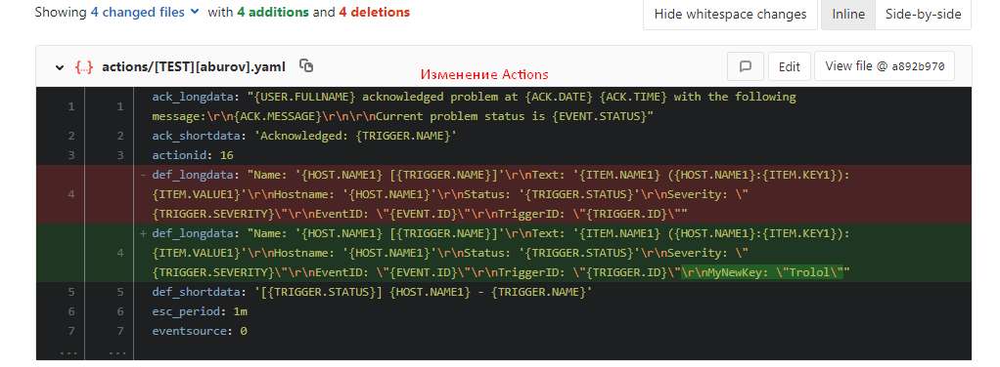

# Zabbix Review and Export
Zabbix review and export (backup) can create review mechanism to zabbix configuration or only export (backup) all hosts templates and other object.

- [Requirements](#requirements)
- [Make export and backup](#make-export-and-backup)
- [Make review](#make-review)
  - [Notes](#notes)
- [Supported objects](#supported-objects)
- [Known issues](#known-issues)
- [Screenshots](#screenshots)

# Requirements
- Installed [Python >=3.4](https://www.python.org/downloads/)


If you want use [review](#make-review):
- `git`
- [GitLab](https://gitlab.com/) - you own instance with configured [GitLab CI](https://docs.gitlab.com/ee/ci/) or cloud account


## Make export and backup
It's simple to start use this script as backup mechanism:
```bash
# git clone THIS_REPO or download archive

python -mpip install -r requirements.xml

python ./zabbix-export.py --help

# backup to current folder XML and JSON
python ./zabbix-export.py --zabbix-url https://zabbix.example.com --zabbix-username user --zabbix-password password

# backup YAML
python ./zabbix-export.py --save-yaml --zabbix-url https://zabbix.example.com --zabbix-username user --zabbix-password password

# backup to custom folder as YAML
python ./zabbix-export.py --save-yaml --directory /home/username/path/to/zabbix-yaml --zabbix-url https://zabbix.example.com --zabbix-username user --zabbix-password password
```

## Make review
If you want to make review (read more on habr.com: [RU](#), [EN translated](#)), use this sequence:
1. Fork this repository to you GitLab account or instance (e.g. `groupname/zabbix-review-export`)
2. Create repository where will be saved XML and YAML (e.g. two repository `groupname/zabbix-xml` and `groupname/zabbix-yaml`. And do first commit (create empty `README.md`)
3. Create two branches in this repos: `master` and `develop`. In repository `groupname/zabbix-xml` set `develop` [default branch](https://docs.gitlab.com/ee/user/project/repository/branches/#default-branch).
4. Specify [Project Variables](https://docs.gitlab.com/ee/ci/variables/#variables) for all variables, specified on top in [.gitlab-ci.yml](./.gitlab-ci.yml)
5. Change jobs in `.gitlab-ci.yml` and Leave the ones you need job in `.gitlab-ci.yml` and change to you environment (see commented examples block).
6. Try to run manual job `YAML zabbix`
7. Create merge request `develop=>master` in `zabbix-yaml`. For first time you can merge without review, it's too hard :)
8. Configure [Schedule](https://docs.gitlab.com/ee/user/project/pipelines/schedules.html) (eg. every week)
9. Change some host, template or other [supported objects](#supported-objects] in zabbix, run manual job and create merge request again. Enjoy!

### Notes
Use two different repositories for XML+JSON (raw-format) and readable YAML format:
- `XML` + `JSON` will be useful if you want restore some object after remove or alarge number of changes.
- `YAML` format is more suitable for people to read and review changes. Also the script removes all empty values.

Also, after merge we create empty merge request `develop=>master` and receive all notifications at changes (schedule or manual jobs run).

To answer for the question "Who make this changes?" you need use [Zabbix Audit](https://www.zabbix.com/documentation/4.0/manual/web_interface/frontend_sections/reports/audit). It's difficult but possible.

## Supported objects
Use standart [zabbix export functional](https://www.zabbix.com/documentation/4.0/manual/api/reference/configuration/export):
- hosts
- templates
- screen

Representing objects as JSON using the API:
- mediatypes
- actions

## Known issues
- [ZBX-15175](https://support.zabbix.com/browse/ZBX-15175): Zabbix export - host's xml does not contain overrides or diff to templates (e.g. item's storage period, trigger.priority, trigger.status=disables\enabled)
- [ZBXNEXT-4862](https://support.zabbix.com/browse/ZBXNEXT-4862): The implementation of functionality in Zabbix. Zabbix configuration as code - save XML in git repository


## Screenshots
YAML change action:


YAML change trigger expression:


XML change templates (but we recommend use YAML for review and XML only for backup):

